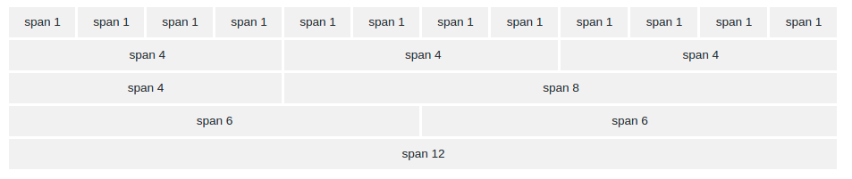

# Bootstrap Grids ( Lưới )

##  Bootstrap 4 Grids

Grids của Bootstrap được xây dựng dựa vào thuộc tính flexbox và cho phép tối đã 12 cột trên 1 trang

Nếu không muốn sử dụng từng cột thì bạn hoàn toàn có thể nhóm các cột lại với nhau để thu được cột rộng hơn



## Các class của grid

* .col-x (tương thích với chiều rộng màn hình < 576px)
* .col-sm-x (tương thích với chiều rộng màn hình >= 576px)
* .col-md-x (tương thích với chiều rộng màn hình >= 768px)
* .col-lg-x (tương thích với chiều rộng màn hình >= 992px)
* .col-xl-x (tương thích với chiều rộng màn hình >= 1200px)

Các class sử dụng màn hình bé hơn sẽ tự động được áp dụng nếu không có class tương thích với màn hình rộng hơn.

Ví dụ: nếu muốn để cùng độ rộng giữa 2 màn sm và md thì chỉ cần sử dụng class sm là đủ

## Cấu trúc cơ bản của Grid

```
<div class="row">
  <div class="col-*-*"></div>
  <div class="col-*-*"></div>
</div>
<div class="row">
  <div class="col-*-*"></div>
  <div class="col-*-*"></div>
  <div class="col-*-*"></div>
</div>

<div class="row">
  <div class="col"></div>
  <div class="col"></div>
  <div class="col"></div>
</div>
```